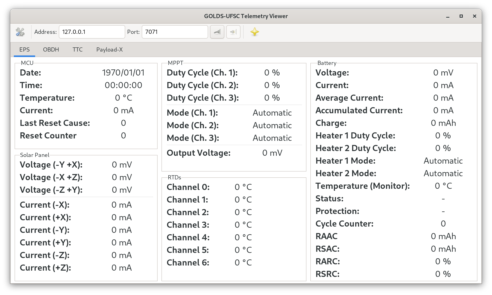

<h1 align="center">
    GOLDS-UFSC Telemetry Viewer
    <br>
</h1>

<h4 align="center">Telemetry visualizer software for the GOLDS-UFSC mission.</h4>

<p align="center">
    <a href="https://github.com/spacelab-ufsc/gutv">
        
    </a>
    <a href="https://github.com/spacelab-ufsc/gutv/releases">
        
    </a>
    <a href="https://github.com/spacelab-ufsc/gutv/blob/main/LICENSE">
        
    </a>
</p>

<p align="center">
    <a href="#overview">Overview</a> •
    <a href="#satellites">Satellites</a> •
    <a href="#dependencies">Dependencies</a> •
    <a href="#license">License</a>
</p>

# Overview

The GOLDS-UFSC Telemetry Viewer (GUTV) is a software to visualize and manage the telemetry data transmitted by the GOLDS-UFSC satellite.

Below, there is an image of the main window of the software:



# Dependencies

* [PyGObject](https://pypi.org/project/PyGObject/)

## Installation on Ubuntu

```sudo apt install python3 python3-gi```

## Installation on Fedora

```sudo dnf install python3 python3-gobject```

## Installing

```python setup.py install```

# Documentation

## Dependencies

* Sphinx
* sphinx-redactor-theme

## Building the Documentation

```make html```

# License

This project is licensed under GPLv3 license.
